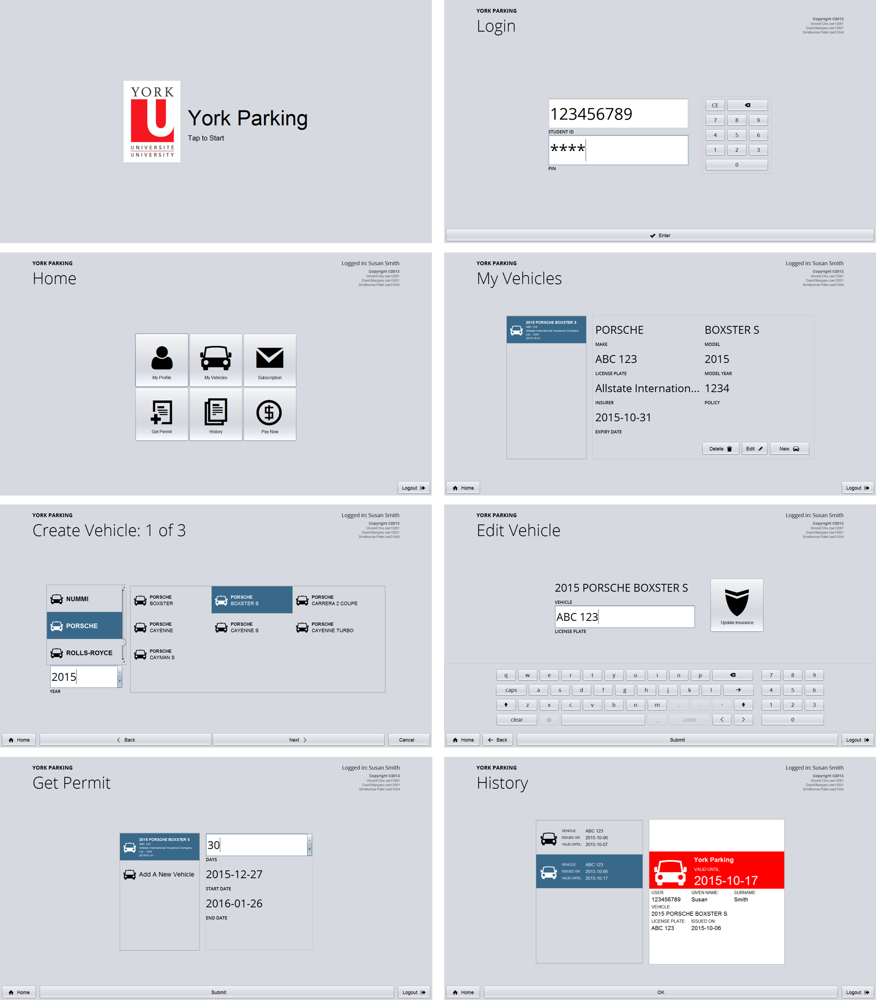
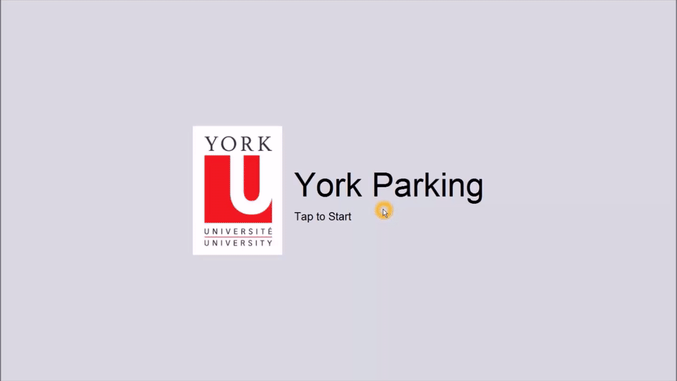

# CSE 3461 - User Interface
## Assignment 1 - York Parking

### Purpose

This goal for this assignment was to create a Java application for a Parking
Permit Kiosk. Like most kiosks, interaction is via a touch screen. The
system’s keyboard is not used. For this assignment, we were required to use
point-and-click operations with the mouse to simulate a touch screen.

[See details](REQUIREMENTS.md)

### Note

This project will not be maintained.
Use at your own risk.
